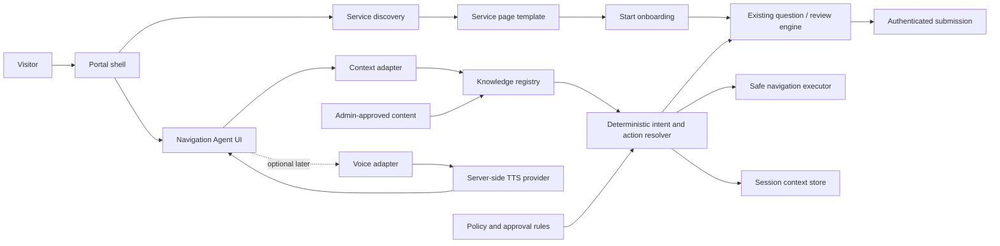

# Nairaleap Service-First Portal and Navigation Agent

## Reconciled Architecture Brief

**Project:** Nairaleap - Service Portal  
**Repository:** [`remRADAR/NairaLeap`](https://github.com/remRADAR/NairaLeap)  
**Date:** 25 August 2026  
**Author:** Manus AI  
**Status:** Architecture proposal and implementation roadmap; the persistent voice/navigation agent is not yet implemented

## Executive recommendation

Nairaleap should evolve from a **service card → modal preview → guided request** experience into a **service discovery → dedicated service page → understood requirements → deliberate onboarding** experience. The existing portal already contains valuable reusable foundations: a configuration-driven service catalog, centralized intent-discovery catalog, shared question engine, structured rundown/review states, authenticated submission, and dedicated Insurance and Mortgage information routes.

The smallest coherent next move is not to rebuild the portal or immediately introduce a free-form AI chatbot. It is to create a reusable service-page template for the existing catalog, then extend the current NairaLeap Guide into a persistent, context-aware **text navigation agent** with deterministic navigation commands and approved knowledge records. Voice/TTS should be a later adapter behind explicit user activation, server-side credentials, transcript parity and a feature flag.

This posture preserves working functionality, reduces hallucination risk, avoids duplicating onboarding logic, and makes the supplied briefs implementable without pretending that every agriculture-specific subservice or voice capability already exists.

## Source reconciliation

The supplied briefs express two related but different changes. The first brief is a service-information architecture brief focused on farmer, farm, production, community, inputs, labour, finance, market, verification and consent stages. The second is an agent brief focused on persistent navigation, contextual help, inactivity prompting, intent routing, voice mode and safe actions.

The current repository is broader than the first brief’s agriculture service taxonomy. Its primary catalog currently contains **12 service IDs**: Agriculture, Property Listings, Business Funding, Partnerships, Vendor Marketplace, Distress Sales, Recycling & Scrap, Business Briefs, Professional Services, Customer Support, Insurance and Mortgage. Therefore, the agriculture-specific concepts from the first brief should be represented as configured agriculture-domain stages or service journeys only where the workspace confirms them; they should not be silently substituted for the existing top-level service catalog.

| Source | Decision carried into architecture |
|---|---|
| `Pasted_content_15.txt` | Make service information discoverable before onboarding; use reusable service pages; preserve progressive disclosure, conditional logic, review/edit, save-and-continue, explicit consent and mobile-first form UX. |
| `Pasted_content_16.txt` | Create a centralized agent knowledge/configuration layer; keep navigation deterministic and safe; use one question at a time; remember only session context; make voice text-identical and user-activated. |
| Current repository | Reuse the existing service catalog, service-intake engine, intent-discovery catalog, Guide modal, service preview sheet, auth flow and authenticated request submission. |
| Product and safety boundary | Do not invent services, prices, guarantees, approvals, partner claims, regulatory status or unsupported requirements. Keep high-impact actions confirmation-gated. |

## Verified current state

The repository currently exposes the homepage, authentication, authenticated dashboard, Agriculture onboarding route, request history, Insurance information route and Mortgage information route. The homepage service cards open a shared `ServicePreviewSheet`, then a `GuidedRequestGateway`, then `NairaLeapGuideContainer`. Cards do not yet route to first-class `/services/{slug}` information pages.

The shared Guide already supports `discovery → service recommendations → questions → review → success`. Its brain-box-like behavior is configuration-driven through `INTENT_DISCOVERY_CATALOG`, `SERVICE_CATALOG`, service question sets and rundown builders. It is not yet a persistent page-level assistant: there is no inactivity trigger, route-context adapter, field-help contract, session-memory store, text chat surface, navigation-command executor or voice/TTS adapter.

The authenticated onboarding route currently implements a specialized Agriculture flow with questions, review and success. It does not yet implement the six-stage Farmer → Farm → Production → Services → Verification → Consent journey described in the agriculture brief. Mortgage and Insurance are the strongest current examples of service-specific information pages, but their onboarding still enters the shared Guide.

## Target experience

The target journey is:

```text
Home / Services
  → Dedicated service information page
  → Understand purpose, process and information categories
  → Start onboarding
  → Context-aware onboarding assistance
  → Review and edit
  → Explicit consent where applicable
  → Confirm high-impact action
  → Completion and request status
```

The navigation agent sits beside this journey as a concierge. It must help a visitor answer **“What are you trying to accomplish on Nairaleap?”** and then guide the visitor to the exact service page or onboarding step. It must not become a second form, a free-form knowledge authority or an autonomous submission agent.

## Logical architecture



The full diagram source and rendered asset are delivered alongside this brief.

## Component responsibilities

| Component | Responsibility | Must not do |
|---|---|---|
| Service-page template | Render hero, purpose, information categories, process, requirements, related services and onboarding CTA from configuration. | Duplicate service-specific forms or invent requirements. |
| Service catalog | Remain the canonical identity, copy, icon, route and onboarding mapping for top-level services. | Become a hidden knowledge store with conflicting content. |
| Knowledge registry | Store approved page, service, process, requirement, field-help, consent, FAQ, quick-action and route records. | Store credentials, arbitrary chat history or unreviewed claims. |
| Context adapter | Expose current route, selected service, onboarding stage, current field and completed stages. | Infer sensitive profile information not present in the active session. |
| Intent resolver | Map ordinary language to a known intent or safe unknown state using the approved catalog. | Invent a service, silently submit data or decide eligibility. |
| Action resolver | Produce typed actions such as `show_service`, `start_onboarding`, `explain_field`, `go_back`, `go_home` and `request_human_help`. | Execute delete, submit or external-sharing actions without confirmation. |
| Navigation executor | Perform safe internal route/history navigation and preserve service context. | Navigate to unsupported or arbitrary external destinations. |
| Session context store | Retain current page, selected service, onboarding stage, recent intent and completed stages for the session. | Persist unnecessary personal data or use conversation memory as a customer profile. |
| Voice adapter | Read the exact visible text response after user activation, with stop/pause and failure fallback. | Autoplay audio, expose provider secrets or create a different hidden response. |
| Existing onboarding engine | Continue to own questions, conditional fields, validation, rundown, review and submission. | Be reimplemented inside the agent. |

## Knowledge model

The knowledge layer should begin as typed, versioned configuration in the repository. A future admin-managed database can replace the storage mechanism without changing the agent contract.

```ts
type KnowledgeRecord = {
  id: string;
  kind:
    | "portal"
    | "service"
    | "service_page"
    | "requirement"
    | "process_step"
    | "route"
    | "quick_action"
    | "field_help"
    | "consent"
    | "faq";
  version: string;
  status: "draft" | "approved" | "retired";
  title: string;
  body: string;
  serviceId?: ServiceId;
  route?: string;
  relatedRecordIds?: string[];
  reviewDate?: string;
};
```

Every answer or navigation suggestion should be traceable to an approved record. If the registry has no approved answer, the agent should state that the information is not currently available and offer the nearest safe navigation option.

## Safe action contract

Navigation and explanation are low-impact actions. Submission, deletion, external sharing, consent changes and any action that permanently changes information are high-impact and require a confirmation surface.

```ts
type AgentAction =
  | { type: "show_service"; serviceId: ServiceId }
  | { type: "start_onboarding"; serviceId: ServiceId }
  | { type: "explain_field"; fieldId: string }
  | { type: "go_back" }
  | { type: "go_home" }
  | { type: "request_human_help" }
  | { type: "confirm_submission"; requestId: string };
```

The first implementation should allow only the first six actions. `confirm_submission` should remain owned by the onboarding flow and should never be invoked merely because a user typed “continue” into the chat.

## Interaction and state model

The agent should appear as a small floating entry point after approximately ten seconds of meaningful inactivity on the homepage or service pages. The appearance is a non-blocking prompt, not a modal. It should not trigger during active form entry, reopen repeatedly after dismissal or automatically speak.

The expanded panel should contain the agent identity, current-context status, conversation transcript, a small set of context-aware quick actions, text input, microphone/voice control and close/minimize control. On mobile it should become a compact bottom sheet that avoids covering the current primary action or form field.

| State | Required behaviour |
|---|---|
| Dormant | Small tappable entry point; no unsolicited audio. |
| Prompted | One short greeting and up to four useful quick actions. |
| Conversing | One response at a time, visible transcript and context-aware suggestions. |
| Navigating | State the destination, execute only a known internal action, then confirm the new page context. |
| Field help | Explain the current approved field purpose in plain language; do not fabricate rationale. |
| Awaiting confirmation | Show the exact action and recipient/data scope; require explicit confirmation. |
| Voice ready/listening/thinking/speaking/paused/error | Keep transcript authoritative; voice failure must not block text navigation. |
| Unknown | Say the portal does not currently have that information and offer a safe next destination. |

## Staged implementation plan

### Stage 0 — Service-first foundations

Create a reusable `ServicePage` template and route mapping for the existing top-level service catalog. Start with the current 12 services so the information architecture becomes consistent without deleting Insurance, Mortgage or other working services. Evolve `ServicePreviewSheet` into a preview or replace it with route-first cards, keeping the shared Guide as the onboarding engine behind the page CTA.

**Exit evidence:** every catalog service has a stable information-page route, service cards expose “Learn more,” the page contains purpose/process/requirements/CTA content, and onboarding starts only after the CTA.

### Stage 1 — Text navigation agent

Build a `NavigationAgentProvider`, `NavigationAgentPanel`, `AgentContextAdapter`, `AgentKnowledgeRegistry` and `AgentActionResolver`. Reuse the existing intent-discovery catalog as the initial routing vocabulary. Add the inactivity prompt, session-only context, safe internal navigation and field-help hooks. Keep the implementation deterministic and text-only.

**Exit evidence:** a first-time visitor can say or type ordinary-language requests for known services, receive source-backed guidance, navigate to a service page, ask for field help during onboarding and recover from unknown intent without console errors.

### Stage 2 — Agriculture journey expansion

Only after the source workspace is confirmed, model the Farmer, Farm, Production, Community, Inputs, Labour, Finance, Market, Verification and Digital Consent stages as explicit configurations. Reuse captured data between stages and retain the existing authentication, review and request-submission boundaries. Implement conditional logic before adding breadth.

**Exit evidence:** the agriculture journey saves progress, supports back/edit, displays explicit consent purposes and passes mobile, validation, refresh and incomplete-state tests.

### Stage 3 — Voice adapter

Add voice only after the text agent is stable. Use a server-side provider adapter with secrets outside the client, explicit user activation, exact transcript-to-speech parity, stop/pause, a serialized speech queue and a text-only fallback. The founder’s cloned voice requires documented authorization and provider compliance before enabling it.

**Exit evidence:** the same visible text is spoken, autoplay does not occur, voice can be stopped, TTS failure leaves navigation usable, and no provider key or private prompt reaches the browser.

### Stage 4 — Admin maintenance and measured rollout

Move approved knowledge records into a controlled admin workflow only when repository configuration becomes insufficient. Add record versioning, review dates, provenance, approval state, audit history and retirement behaviour. Launch behind a feature flag and measure navigation completion, unknown intents, dismissals, route errors and voice failures without retaining unnecessary personal data.

**Exit evidence:** content changes are reviewable, stale records are not served as approved answers, rollback is available and telemetry contains no raw personal or sensitive onboarding data.

## Security, privacy and reliability controls

The agent must not receive Supabase secrets, service-role keys, voice-provider credentials, internal prompts or private knowledge sources in client code. Session memory should contain route and workflow context rather than raw personal information. Any future server-side language model or TTS call must use an allowlisted knowledge subset and deterministic action schema.

All navigation actions should be allowlisted and validated against the route registry. External links, partner handoffs, consent changes and submissions require explicit confirmation. The system should log safe action outcomes and correlation IDs without logging passwords, tokens, document contents, identity numbers or exact financial values.

Inactivity timers must be cancelable and pause while the user is actively typing, submitting, using a dialog or interacting with a form. The agent must degrade to static text if JavaScript, speech recognition, TTS or any external model service is unavailable.

## Open decisions

| Decision | Recommendation | Status |
|---|---|---|
| First service-page scope | Apply the template to the existing top-level catalog, beginning with Agriculture, Finance, Market, Insurance and Mortgage as representative patterns. | Requires product approval |
| Agriculture taxonomy | Treat Farmer/Farm/Production/etc. as a confirmed domain journey only after the workspace source is approved. | **UNVERIFIED** |
| Agent intelligence | Start deterministic and catalog-backed; add a server-side model only for bounded classification/drafting later. | Recommended |
| Voice provider | Select only after legal, consent, latency, language-quality and cost review. | **UNVERIFIED** |
| Founder voice | Require explicit documented authorization and provider consent before any enablement. | Required gate |
| Knowledge administration | Keep typed repository config initially; add admin UI after content volume and ownership justify it. | Recommended |
| Live external navigation | Keep disabled until destination ownership, URL allowlists, consent and audit requirements are approved. | Required gate |

## Acceptance criteria for the architecture

The implementation should be considered complete only when users can understand a service before onboarding, service context survives into onboarding, the agent can safely map ordinary language to known services, current page and onboarding stage are available to the agent, unknown questions do not produce invented answers, high-impact actions require confirmation, voice remains optional and transcript-identical, and existing authenticated request flows continue to work.

No production claim should be made for the persistent navigation agent, voice mode, dedicated pages for every service or the expanded six-stage agriculture journey until the relevant exit evidence exists.

## References

1. `Pasted_content_15.txt` — supplied Nairaleap service-first portal brief, reviewed from the user attachment.
2. `Pasted_content_16.txt` — supplied Nairaleap navigation agent master implementation prompt, reviewed from the user attachment.
3. [`src/features/services/serviceCatalog.ts` — current service registry](../src/features/services/serviceCatalog.ts)
4. [`src/features/intent-discovery/intentDiscoveryCatalog.ts` — current intent catalog](../src/features/intent-discovery/intentDiscoveryCatalog.ts)
5. [`src/components/ui/NairaLeapGuideContainer.tsx` — current guided request flow](../src/components/ui/NairaLeapGuideContainer.tsx)
6. [`src/components/ui/ServicePreviewSheet.tsx` — current service preview surface](../src/components/ui/ServicePreviewSheet.tsx)
7. [`src/routes/index.tsx` — current homepage service discovery and routing](../src/routes/index.tsx)
8. [`src/routes/_authenticated/onboarding.$service.tsx` — current Agriculture onboarding route](../src/routes/_authenticated/onboarding.$service.tsx)
